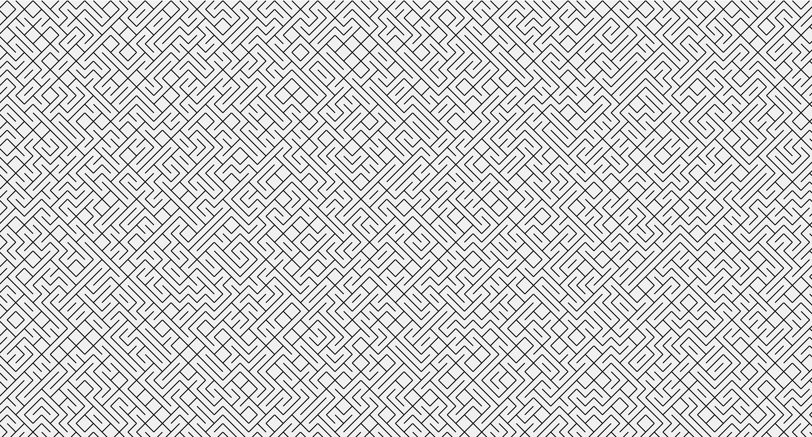

# GOTO10
My implementation of the GOTO10 Pattern

## Description

I got the inspiration for this project from [Daniel Shiffman](https://www.youtube.com/channel/UCvjgXvBlbQiydffZU7m1_aw). In his version, he writes the program using p5.js.
The video and code for his solution can be found: [here](https://www.youtube.com/watch?v=bEyTZ5ZZxZs)

I wrote this without following code conventions. I just wanted to figure out the math behind, and even that isn't top notch.

### Output

- An example output from the program is as follows:

- Note that you can change most of the configuration, such as line length, width, screen size, probability of a forward slash vs a backslash and vice versa.
  - This produces very different results
  - Also, if you keep the random seed set, then the output can be measured and repeated, this is because computers implement [pseudo randomness](https://en.wikipedia.org/wiki/Pseudorandomness)